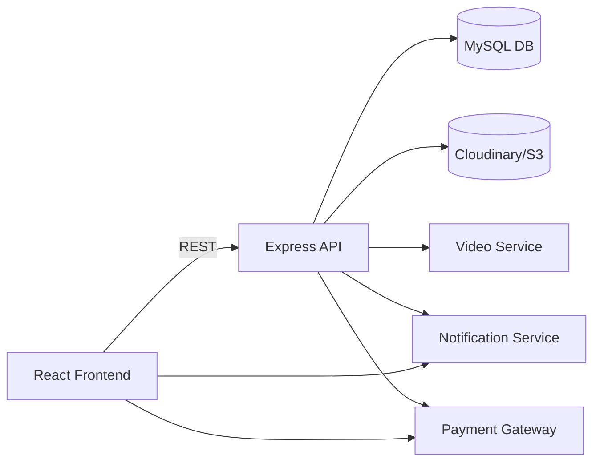

# Architecture Overview

**BabyCare+** is a modular web platform built with React (frontend) and Express/Node.js (backend). The new **Adoption** module integrates as a bounded context.

### High‑level Components
- **Frontend** – React SPA (or Next.js) with role‑based routes (`ProtectedRoute`). Each role has its own dashboard (glass‑morphism UI).
- **API Gateway** – `src/services/api.js` (Axios instance) adds JWT to every request.
- **Adoption Service** – Express router `backend/routes/adoption.js` protected by `auth` and `permit` middleware.
- **Database** – MySQL (or PostgreSQL) schema defined in `docs/database_schema.md`.
- **File Storage** – Cloudinary (or AWS S3) for document and child image uploads.
- **Video Meetings** – WebRTC / Zoom API integration via `meeting_system` service.
- **Notifications** – Firebase Cloud Messaging or Socket.io for real‑time alerts.
- **Payments** – Stripe (or PayPal) integrated through `payment_integration` service.
- **Audit & Logging** – Centralised logging (Winston) and audit tables.

The Adoption module communicates with existing authentication, notification, and payment services through shared middleware and utility libraries.
