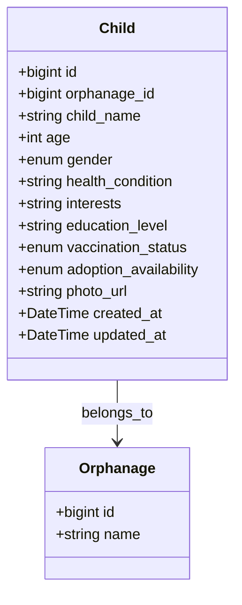

# Child Profile Design

## Data Model

## Privacy Policy
- **Public fields** (visible to Parents): `child_name`, `age`, `gender`, `health_condition` (general), `interests`, `education_level`, `vaccination_status`, `adoption_availability`, `photo_url` (watermarked).
- **Restricted fields**: internal notes, exact medical records, detailed health conditions – only visible to Orphanage Admin, Verification Officer, and Legal Officer.
- **Image Protection**:
  - Images stored in Cloudinary/AWS S3 with **access control list (ACL) private**.
  - Served via signed URL that expires after 5 minutes.
  - Watermark with “© BabyCare+” added on the fly for public view.
- **Security Measures**:
  - All read requests require JWT and role check (`parent` can only see public fields).
  - Sensitive fields are omitted from API responses for `parent` role.
  - Audit log entry created for every profile view (user_id, child_id, timestamp).

## API Endpoints (excerpt)
- `GET /adoption/children` – returns list with public fields.
- `GET /adoption/children/:id` – if requester.role=`parent` → public fields only; else full fields.
- `POST /adoption/children` – **Orphanage Admin** only, includes `photo` upload (multipart).
- `PATCH /adoption/children/:id` – **Orphanage Admin** only.

## Validation Rules
- `age` must be >=0 and <=18.
- `vaccination_status` must be one of `up_to_date`, `partial`, `none`.
- `adoption_availability` defaults to `available`; can be changed to `under_review` when an application is active.

## Access Summary
| Role | Can View | Can Edit |
|------|----------|----------|
| Parent | Public fields only | ❌ |
| Orphanage Admin | All fields | ✅ (create / update) |
| Verification Officer | All fields | ❌ |
| Legal Officer | All fields | ❌ |
| Super Admin | All fields | ✅ |

---
*All sensitive data is encrypted at rest (AES‑256) and transmitted over HTTPS.*
