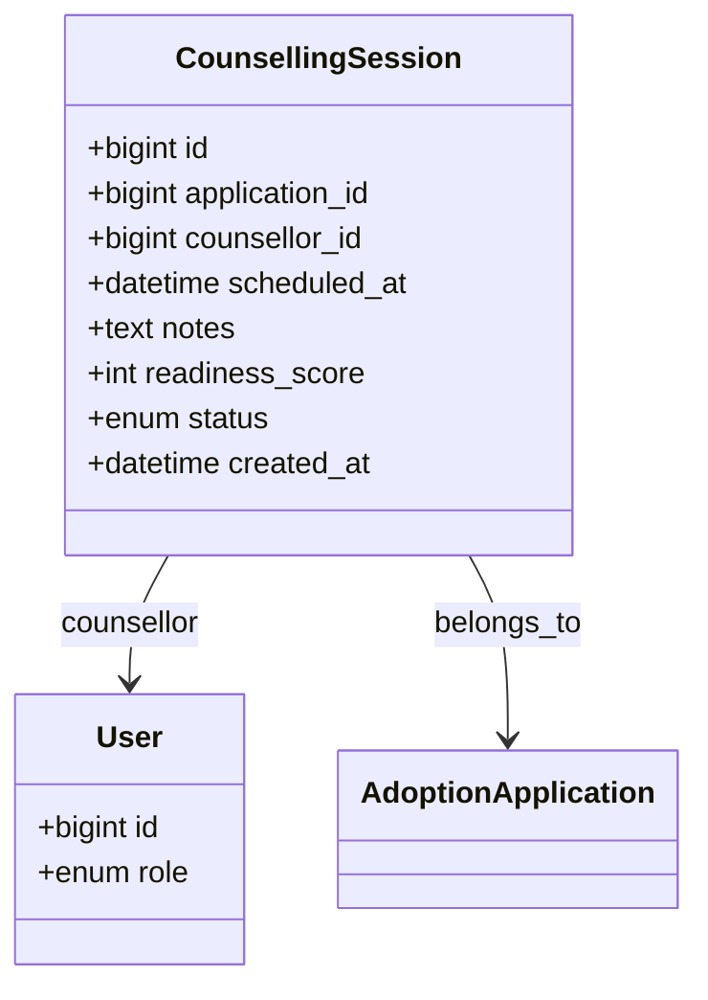

# Counselling Session System

## Overview
Counselling supports parents' emotional readiness and ensures child‑parent compatibility before final approval. The system schedules sessions, records notes, and produces a readiness score used by the Legal Officer.

## Data Model

## API Endpoints
| Method | Path | Role | Description |
|--------|------|------|-------------|
| `POST`   | `/adoption/counselling_sessions` | `counsellor` | Create a new session (schedule). |
| `GET`    | `/adoption/counselling_sessions/:id` | `counsellor`, `parent` | Retrieve session details and notes. |
| `PATCH`  | `/adoption/counselling_sessions/:id` | `counsellor` | Update notes, set `readiness_score`, change status. |
| `GET`    | `/adoption/applications/:id/counselling` | `parent`, `orphanage_manager` | List sessions for an application. |

## Scheduling Flow
1. **Orphanage Admin** (or system) triggers a counselling request after document verification.
2. **Counsellor** sees the pending request on the Counselling Dashboard, selects a time slot, and creates a session via `POST /adoption/counselling_sessions`.
3. **Notification Service** sends an email/SMS to the parent with the scheduled time.
4. During the video call (WebRTC or Zoom), the counsellor records observations in the `notes` field and assigns a **readiness score** (0‑100).
5. After completion, the counsellor marks the session `status='completed'`. The score is stored and later read by the Legal Officer during legal review.

## Security & Privacy
- Only the assigned counsellor and the parent involved can view the session details.
- All notes are encrypted at rest (AES‑256) and transmitted over HTTPS.
- Audit log entry created for every session creation, view, and update.
- Session recordings (if any) are stored in a separate protected bucket with strict ACL.

## UI/UX
- **Counselling Dashboard** shows a calendar view of upcoming sessions.
- Session cards display status badge (Scheduled / Completed / Cancelled) and a quick‑view of the readiness score.
- After a session, a modal form lets the counsellor enter notes and a numeric score.

---
*All related tables are defined in `database_schema.md`.*
