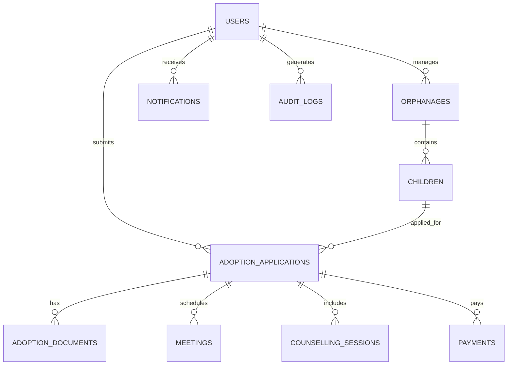

# Database Schema for Baby Adoption Module

## Overview
The adoption module uses a relational database (MySQL/PostgreSQL). All tables are placed in the `adoption` schema to isolate them from other modules.

## Tables

### 1. `users`
| Column | Type | Constraints |
|--------|------|-------------|
| `id` | BIGINT UNSIGNED | PRIMARY KEY, AUTO_INCREMENT |
| `name` | VARCHAR(255) | NOT NULL |
| `email` | VARCHAR(255) | NOT NULL, UNIQUE |
| `password_hash` | VARCHAR(255) | NOT NULL |
| `role` | ENUM('parent','orphanage_manager','super_admin','counsellor','verification_officer','legal_officer') | NOT NULL |
| `created_at` | TIMESTAMP | DEFAULT CURRENT_TIMESTAMP |
| `updated_at` | TIMESTAMP | DEFAULT CURRENT_TIMESTAMP ON UPDATE CURRENT_TIMESTAMP |

### 2. `orphanages`
| Column | Type | Constraints |
|--------|------|-------------|
| `id` | BIGINT UNSIGNED | PRIMARY KEY, AUTO_INCREMENT |
| `name` | VARCHAR(255) | NOT NULL |
| `address` | TEXT | NOT NULL |
| `license_number` | VARCHAR(100) | NOT NULL, UNIQUE |
| `manager_id` | BIGINT UNSIGNED | NOT NULL, FOREIGN KEY → `users.id` (must have role `orphanage_manager`) |
| `created_at` | TIMESTAMP | DEFAULT CURRENT_TIMESTAMP |
| `updated_at` | TIMESTAMP | DEFAULT CURRENT_TIMESTAMP ON UPDATE CURRENT_TIMESTAMP |

### 3. `children`
| Column | Type | Constraints |
|--------|------|-------------|
| `id` | BIGINT UNSIGNED | PRIMARY KEY, AUTO_INCREMENT |
| `orphanage_id` | BIGINT UNSIGNED | NOT NULL, FOREIGN KEY → `orphanages.id` |
| `child_name` | VARCHAR(255) | NOT NULL |
| `age` | INT | NOT NULL |
| `gender` | ENUM('male','female','non_binary') | NOT NULL |
| `health_condition` | VARCHAR(255) | NULL |
| `interests` | VARCHAR(255) | NULL |
| `education_level` | VARCHAR(100) | NULL |
| `vaccination_status` | ENUM('up_to_date','partial','none') | NOT NULL |
| `adoption_availability` | ENUM('available','under_review','adopted') | NOT NULL, DEFAULT 'available' |
| `photo_url` | VARCHAR(500) | NULL |
| `created_at` | TIMESTAMP | DEFAULT CURRENT_TIMESTAMP |
| `updated_at` | TIMESTAMP | DEFAULT CURRENT_TIMESTAMP ON UPDATE CURRENT_TIMESTAMP |

### 4. `adoption_applications`
| Column | Type | Constraints |
|--------|------|-------------|
| `id` | BIGINT UNSIGNED | PRIMARY KEY, AUTO_INCREMENT |
| `parent_id` | BIGINT UNSIGNED | NOT NULL, FOREIGN KEY → `users.id` (role `parent`) |
| `child_id` | BIGINT UNSIGNED | NOT NULL, FOREIGN KEY → `children.id` |
| `application_status` | ENUM('submitted','under_review','documents_verified','meeting_scheduled','counselling','legal_review','approved','rejected','completed') | NOT NULL, DEFAULT 'submitted' |
| `compatibility_score` | INT | NULL |
| `created_at` | TIMESTAMP | DEFAULT CURRENT_TIMESTAMP |
| `updated_at` | TIMESTAMP | DEFAULT CURRENT_TIMESTAMP ON UPDATE CURRENT_TIMESTAMP |

### 5. `adoption_documents`
| Column | Type | Constraints |
|--------|------|-------------|
| `id` | BIGINT UNSIGNED | PRIMARY KEY, AUTO_INCREMENT |
| `application_id` | BIGINT UNSIGNED | NOT NULL, FOREIGN KEY → `adoption_applications.id` |
| `doc_type` | ENUM('national_id','passport','income_proof','marriage_certificate','police_clearance','medical_certificate') | NOT NULL |
| `file_url` | VARCHAR(500) | NOT NULL |
| `verified` | BOOLEAN | NOT NULL, DEFAULT FALSE |
| `verified_by` | BIGINT UNSIGNED | NULL, FOREIGN KEY → `users.id` (role `verification_officer`) |
| `verified_at` | TIMESTAMP | NULL |

### 6. `meetings`
| Column | Type | Constraints |
|--------|------|-------------|
| `id` | BIGINT UNSIGNED | PRIMARY KEY, AUTO_INCREMENT |
| `application_id` | BIGINT UNSIGNED | NOT NULL, FOREIGN KEY → `adoption_applications.id` |
| `scheduled_at` | DATETIME | NOT NULL |
| `meeting_link` | VARCHAR(500) | NOT NULL |
| `status` | ENUM('scheduled','completed','cancelled') | NOT NULL, DEFAULT 'scheduled' |
| `created_at` | TIMESTAMP | DEFAULT CURRENT_TIMESTAMP |

### 7. `counselling_sessions`
| Column | Type | Constraints |
|--------|------|-------------|
| `id` | BIGINT UNSIGNED | PRIMARY KEY, AUTO_INCREMENT |
| `application_id` | BIGINT UNSIGNED | NOT NULL, FOREIGN KEY → `adoption_applications.id` |
| `counsellor_id` | BIGINT UNSIGNED | NOT NULL, FOREIGN KEY → `users.id` (role `counsellor`) |
| `scheduled_at` | DATETIME | NOT NULL |
| `notes` | TEXT | NULL |
| `readiness_score` | INT | NULL |
| `status` | ENUM('scheduled','completed','cancelled') | NOT NULL, DEFAULT 'scheduled' |
| `created_at` | TIMESTAMP | DEFAULT CURRENT_TIMESTAMP |

### 8. `notifications`
| Column | Type | Constraints |
|--------|------|-------------|
| `id` | BIGINT UNSIGNED | PRIMARY KEY, AUTO_INCREMENT |
| `user_id` | BIGINT UNSIGNED | NOT NULL, FOREIGN KEY → `users.id` |
| `type` | VARCHAR(100) | NOT NULL |
| `payload` | JSON | NOT NULL |
| `read` | BOOLEAN | NOT NULL, DEFAULT FALSE |
| `created_at` | TIMESTAMP | DEFAULT CURRENT_TIMESTAMP |

### 9. `payments`
| Column | Type | Constraints |
|--------|------|-------------|
| `id` | BIGINT UNSIGNED | PRIMARY KEY, AUTO_INCREMENT |
| `application_id` | BIGINT UNSIGNED | NOT NULL, FOREIGN KEY → `adoption_applications.id` |
| `amount_cents` | BIGINT UNSIGNED | NOT NULL |
| `currency` | VARCHAR(10) | NOT NULL |
| `status` | ENUM('pending','succeeded','failed','refunded') | NOT NULL, DEFAULT 'pending' |
| `provider_transaction_id` | VARCHAR(255) | NULL |
| `created_at` | TIMESTAMP | DEFAULT CURRENT_TIMESTAMP |

### 10. `audit_logs`
| Column | Type | Constraints |
|--------|------|-------------|
| `id` | BIGINT UNSIGNED | PRIMARY KEY, AUTO_INCREMENT |
| `user_id` | BIGINT UNSIGNED | NULL, FOREIGN KEY → `users.id` |
| `action` | VARCHAR(255) | NOT NULL |
| `target_table` | VARCHAR(100) | NULL |
| `target_id` | BIGINT UNSIGNED | NULL |
| `details` | JSON | NULL |
| `created_at` | TIMESTAMP | DEFAULT CURRENT_TIMESTAMP |

## Relationships
- **One‑to‑Many**: `orphanages` → `children`; `users` (orphanage manager) → `orphanages`.
- **One‑to‑Many**: `children` → `adoption_applications`.
- **One‑to‑Many**: `adoption_applications` → `adoption_documents`, `meetings`, `counselling_sessions`, `payments`.
- **Many‑to‑Many** (implicit via join tables): None needed; role assignments are stored in `users.role` enum.

## ER Diagram (Mermaid)

*All tables use `BIGINT UNSIGNED` for primary keys to support high volume and future sharding.*
