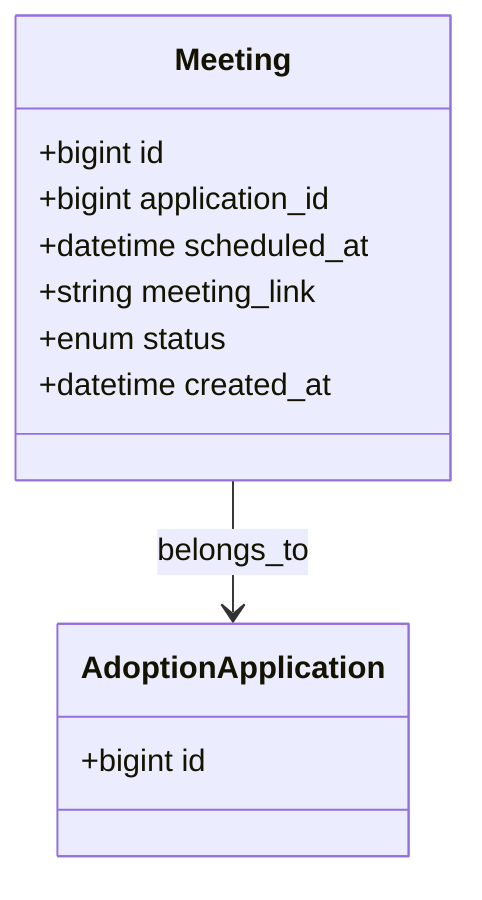

# Meeting System Documentation

## Overview
The **Online Meeting System** enables virtual interviews between parents, orphanage staff, and counsellors. It provides scheduling, secure video links, reminders, and a history log.

## Data Model

## API Endpoints
| Method | Path | Role | Description |
|--------|------|------|-------------|
| `POST` | `/adoption/meetings` | `orphanage_manager` | Schedule a new meeting for an application. |
| `GET`  | `/adoption/meetings/:id` | `parent`, `counsellor`, `orphanage_manager` | Retrieve meeting details (including signed URL). |
| `PATCH`| `/adoption/meetings/:id` | `orphanage_manager` | Update status (`completed`, `cancelled`). |
| `GET`  | `/adoption/applications/:id/meetings` | `parent` | List all meetings for a specific application. |

## Scheduling Flow
1. **Frontend** – Calendar UI on the Orphanage Dashboard (`/dashboard/adoption#meetups`). User selects date/time; UI calls `POST /adoption/meetings`.
2. **Backend** – Controller validates that the applicant is linked to the orphanage, creates a UUID meeting ID, generates a secure video URL using the chosen provider (WebRTC via Daily.co or Zoom API).
3. **Storage** – Meeting record saved in `meetings` table.
4. **Notifications** – Notification Service sends email/SMS to parent and counsellor with the link (expires after 48 h).
5. **Join** – Parent clicks the link; the video session is launched in a new window with end‑to‑end encrypted signaling.
6. **Completion** – After the call, the counsellor marks the meeting as `completed`; this triggers the next workflow step.

## Security
- Video URLs are **signed, time‑limited** (5‑minute tokens).
- Access is restricted via JWT middleware; the endpoint returns the URL only if `req.user.id` matches the parent or counsellor of the application.
- All meeting metadata is stored encrypted at rest (AES‑256).
- Audit log entry created for each meeting creation, update, and access.

## Reminder System
- A **cron job** runs hourly, checks meetings with `status='scheduled'` and `scheduled_at` within 24 h, then pushes a notification via Firebase Cloud Messaging and an email reminder.
- If a meeting is cancelled, the job removes pending reminders.

---
*All tables are defined in `database_schema.md`. The video provider can be swapped by changing the `meetingProvider` configuration in `src/config.js`.*
